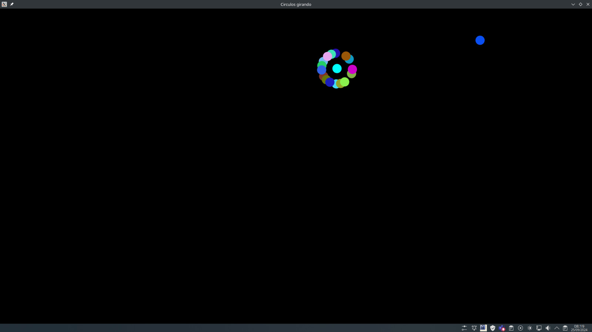

# Game_getCircule
Welcome to GetCircule, a captivating game where you capture spinning circles using your mouse. This game is built using SFML in C++.

# Technologies Used:
  SFML (Simple and Fast Multimedia Library): The game leverages SFML for smooth graphics and window management.
  C++ Programming: The core logic and functionality are implemented in C++ for efficiency and performance
